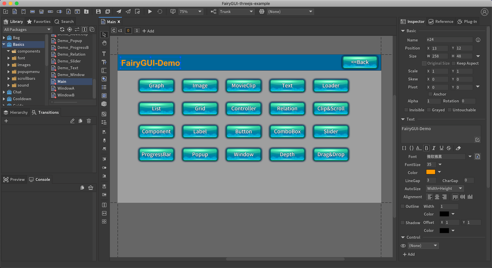

# FairyGUI-three

#### A GUI Editor&amp;framework for Three.js ####

Official website: [www.fairygui.com](https://www.fairygui.com)

### Usage ###

Step 1, we use the editor to create the UI.



Step 2, we only need a little code to display it.

```javascript
import * as fgui from "fairygui-three";

var renderer;
var scene;
var view;

init();
animate();

function init() {
    //THREE initialization code here

    fgui.Stage.init(renderer);
    fgui.Stage.scene = scene;

    fgui.UIPackage.loadPackage('path/to/UI').then(()=> {
        view = fgui.UIPackage.CreateObject('Basics', 'Main');
        view.makeFullScreen();
        fgui.GRoot.inst.addChild(view);
    });
}

function animate() {

    requestAnimationFrame( animate );

    fgui.Stage.update();
    renderer.render(scene, fgui.Stage.camera);
}
```

You should see [this](https://fairygui.com/threejs-demo/main/)

In the example above, an UI is created and displayed by an orthographic camera (fgui.Stage.camera) . It's easy to display UI by an specific perspective camera.

```javascript
import * as fgui from "fairygui-three";

var renderer;
var scene;
var camera;
var view;

init();
animate();

function init() {
    //THREE initialization code here

    camera = new THREE.PerspectiveCamera( 70, window.innerWidth / window.innerHeight, 0.01, 10 );
	camera.position.z = 1;

    fgui.Stage.init(renderer);
    fgui.Stage.scene = scene;

    fgui.UIPackage.loadPackage('path/to/UI').then(()=> {
        view = fgui.UIPackage.CreateObject('3DInventory', 'Main');
        view.displayObject.camera = camera;
        view.displayObject.setLayer(0);

        let container = new Group();
        container.scale.set(0.5, 0.5, 0.5);
        container.add(view.obj3D);
        scene.add(container);
    });
}

function animate() {

    requestAnimationFrame( animate );

    fgui.Stage.update();
    renderer.render(scene, camera);
}
```

You should see [this](https://fairygui.com/threejs-demo/3d/)


# License
MIT
